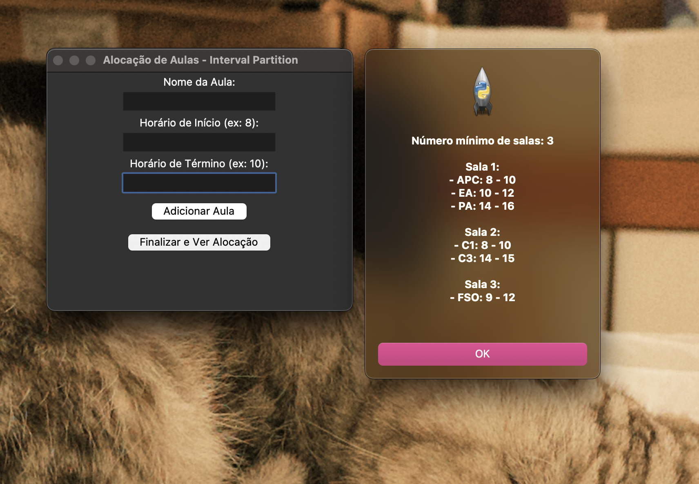

# Greed_Dupla12

**Número da Lista**: 3


**Conteúdo da Disciplina**: FGA0124 - PROJETO DE ALGORITMOS - T01  


## Alunos


<div align = "center">
<table>
  <tr>
    <td align="center"><a href="https://github.com/BiancaPatrocinio7"><br /><sub><b>Bianca Patrocínio</b></sub></a><br /><a href="Link git" title="Rocketseat"></a></td>
    <td align="center"><a href="https://github.com/leticiatmartins"><br /><sub><b>Leticia Torres </b></sub></a><br />
  </tr>
</table>

| Matrícula   | Aluno                             |
| ----------- | ---------------------------------- |
| 22/1008801  | Bianca Patrocínio Castro           |
| 20/2016702  | Leticia Torres Soares Martins      |
</div>

# Sobre 

## 🎓 Interval Partition com HEAP – Simulador de Aulas

Este projeto simula a alocação de aulas em salas usando o algoritmo **Interval Partition**, utilizando uma **fila de prioridade (Heap)**. O objetivo é alocar o menor número possível de salas para um conjunto de aulas, garantindo que não haja sobreposição de horários.


## Screenshots

<p align="center">
  
</p>
<p align="center"><i>Interface gráfica do simulador de alocação de aulas</i></p>

---

## 🛠️ Instalação 
**Linguagem**: Python 3.10+

## ✅ Pré-requisitos

Antes de rodar o projeto, você precisará ter os seguintes programas instalados:

- Python 3.10 ou superior
- `pip` (gerenciador de pacotes Python)


#### No Linux (Ubuntu/Debian):

No Linux, instale o Python com:

```bash
sudo apt update
sudo apt install python3 python3-pip
```

---

## 🚀 Como compilar e executar o projeto

### Passo 1: Clonar o repositório

```bash
git clone https://github.com/projeto-de-algoritmos-2025/Greed_Dupla12.git
cd Greed_Dupla12
```

---

### Passo 2: (Opcional) Criar ambiente virtual

```bash
python3 -m venv venv
source venv/bin/activate  # No Windows: venv\Scripts\activate
```

---

### Passo 3: Entrar na pasta projeto

```bash
cd projeto/
```

---

### Passo 4: Rodar o projeto

```bash
python interface_aulas.py 
```
ou

```bash
python3 interface_aulas.py   
```

---

## 🧪 Uso

1. Execute o projeto no terminal.
2. Insira os dados das aulas (nome, horário de início e de término).
3. Digite `fim` para encerrar a entrada.
4. O programa exibirá quantas salas são necessárias e quais aulas estão em cada uma.

---

## 📽️ Apresentação

Este projeto foi desenvolvido com fins educacionais para demonstrar a aplicação do algoritmo de particionamento de intervalos usando estruturas eficientes como heap. A simulação auxilia no entendimento da alocação de recursos em problemas de agendamento.

---

<font size="3"><p style="text-align: center">Autor: [Bianca Patrocínio](https://github.com/BiancaPatrocinio7) e [Letícia Torres](https://github.com/leticiatmartins).</p></font>

```


